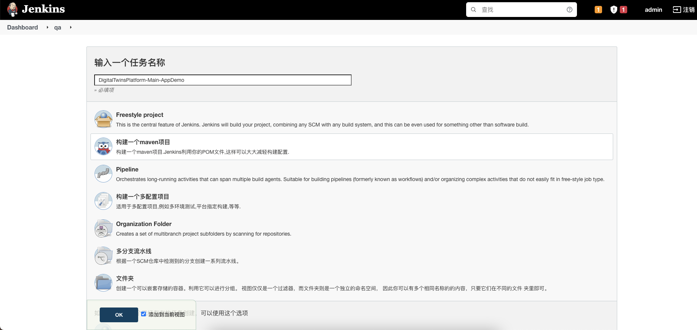
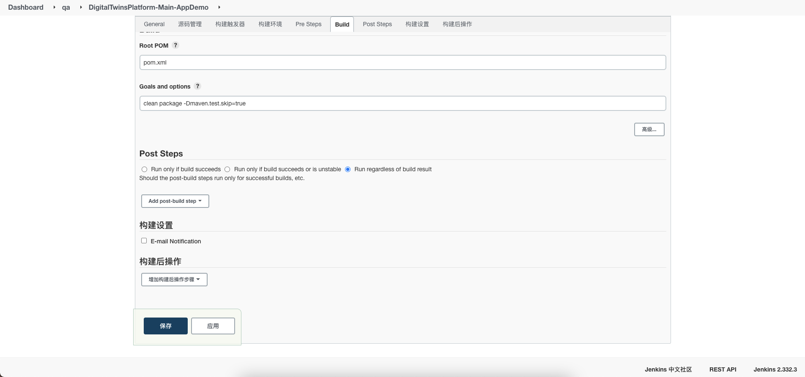

## 打包脚本

首先在打包的项目目录 test/resources 下增加如下两个脚本：

`build.sh`，`Dockerfile`

Dockerfile

```dockerfile
FROM frolvlad/alpine-java:jdk8-slim
ADD xx.jar app.jar
ENTRYPOINT ["java","-jar","-Dspring.profiles.active=qa","/app.jar"]
```

需要修改的项目：

- 需要修改 xx.jar 为项目的 jar包名称即可。

build.sh

```bash
#! /bin/bash

# jenkins 数据目录
jenkinsHome=/root/.jenkins/workspace
# 构建的名称
buildName=DigitalTwinsPlatform-Main-AppDemo
# 项目名称
projectName=digitaltwins-appdemo
# jar包的名称
jarName=digitaltwins-appdemo-0.0.1-SNAPSHOT.jar
# docker image name
dockerImageName=digital-twins/main-appdemo
# container name
dockerContainerName=main-appdemo
# 端口映射
port=8070:8070

# 停掉容器并删除
for i in `docker ps | grep $dockerContainerName |awk '{print $1}'`
do
	docker stop $i
done
for i in `docker ps -a | grep $dockerContainerName |awk '{print $1}'`
do
	docker rm -f $i
done

# 删除镜像
for i in `docker images|grep $dockerContainerName |awk '{print $1}'`
do
	docker rmi $i
done
echo "清除历史镜像和容器完毕!"
# 构建镜像
echo "当前位置:"
pwd
cd $projectName/target
cp $jarName classes
cd classes
chmod +x build.sh
docker build -t $dockerImageName:latest .

# 运行镜像，生成容器实例
docker run -itd --name $dockerContainerName --network=host -p $port $dockerImageName
```


需要修改的项目：

- buildName：构建的名称，和 jenkins 构建的名称保持一致。
- projectName：项目的名称，pom 中 name 的名称 `<name>digitaltwins-appdemo</name>`。
- jarName：生成的 jar 包的名称。由 pom 中的 `name-version.jar` 构成。
- dockerImageName：docker镜像的名称。
- dockerContainerName：运行的容器的名称。
- port：端口的映射，需要指定 `宿主：容器`。


## 新建项目

新建一个 maven 构建,名称和`build.sh`中的`buildName`保持一致。



## 源码管理

配置原码地址,执行项目地址，用户和需要打包的分支。


## Build

构建选择Maven的pom，跳过测试。



## Post Steps

构建步骤，勾选 Run regardless （不管是否 maven 是否 build 成功都执行脚本）

构建命令选择 Execute shell ，添加执行脚本如下：

```bash
sh $WORKSPACE/xxx/target/classes/build.sh
```

- xxx：具体的项目名称。

